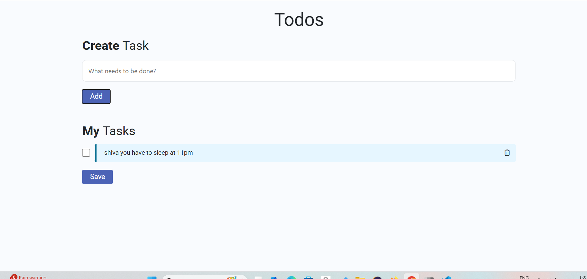
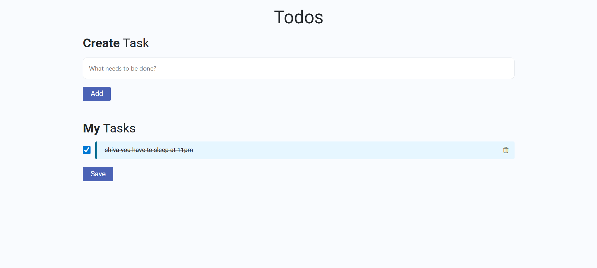
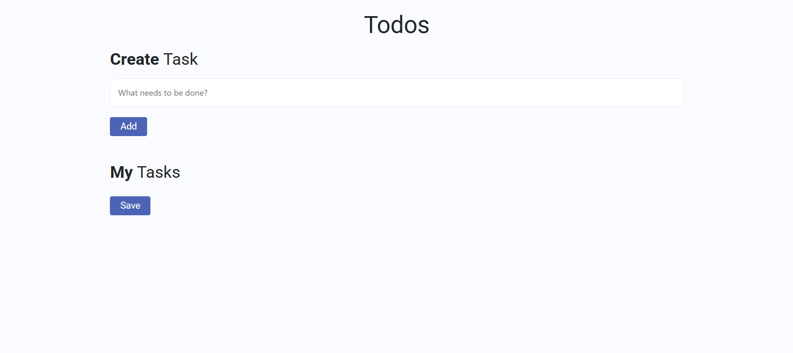

# 📝 Todo List Web Application

A simple and responsive Todo List application built with HTML, CSS, Bootstrap, and JavaScript.
It allows users to add, update, delete, and mark tasks as completed, with data persistence using Local Storage.

## 🔥 Features

- ➕ Add new tasks
- ✅ Mark tasks as completed / uncompleted
- ❌ Delete tasks
- 💾 Save tasks to Local Storage (data persists even after page refresh)
- 🎨 Responsive UI using Bootstrap 4 + custom CSS
- ⚡ Real-time updates using DOM manipulation & event handling

## 🛠️ Tech Stack

## Frontend:


 


# Logic:


# Storage: 
- Browser Local Storage

## 📸 Screenshots






## 🚀 How to Run Locally

Clone this repo:

```bash
git clone https://github.com/your-username/todo-list-app.git
```

Open the folder and launch index.html in your browser.

## 📌 Future Enhancements

- ⏰ Add due dates & reminders
- 🗂️ Categorize tasks (Work, Personal, etc.)
- 🔍 Add search & filter functionality
- ☁️ Connect with a backend (Node.js)


## 👨‍💻 Author
 - [@Shiva Kumar Angari](https://www.github.com/shivakumar1437)